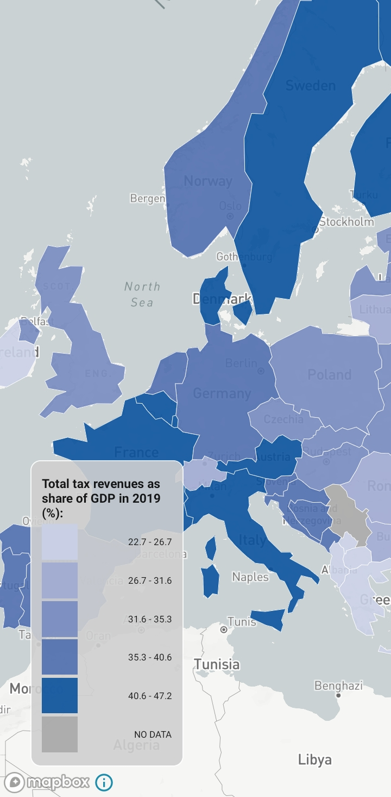
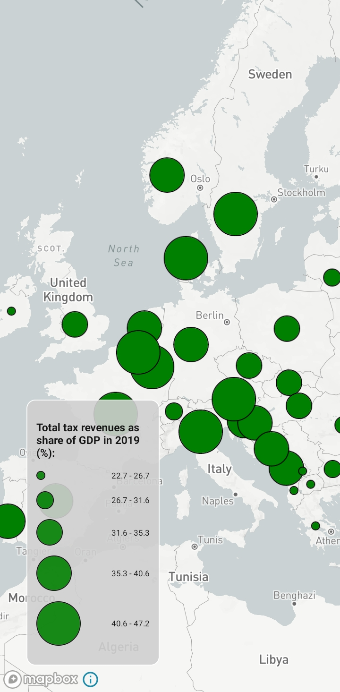

# Mapbox_UX

The prototype application creates two different map types (choropleth or graduated symbol map) to visualize geospatial data on a mobile device. These maps use different colors and different sizes as visual variables to perceive information. 

## Prerequisites

This application is built with React Native. Follow the `React Native CLI Quickstart` installation guide from the official docs.

## Installation Guide

To make the app run, follow the upcoming instructions.

1. Download/Clone this repository.
2. Install dependencies in root folder using npm:
```
npm install
```
3. Run the react-native application:
```
react-native run-android
```

## Geospatial Datasets and Country Boundaries
The repository contains geospatial data and a geojson file with european country boundaries. You can find the files in the `data` folder. For better performance the resolution is set to low quality by default. To increase the resolution change it from low to medium or high in `App.js` in line 6. Country boundaries were downloaded from [https://geojson-maps.ash.ms](https://geojson-maps.ash.ms). The datasets displayed on the maps were open-source and were provided as JSON datasets from the articles at [Our World in Data](https://ourworldindata.org). 

## Map Configuration
The map can be configured in the `data/config.json` file. Here, you can set the visualization type to "graduated_symbol" or "choropleth". If the visualization type is "graduated_symbol", the size distance can be set as "current_constant". If the visualization type is "choropleth", the color distance can be set as "current_color_distance". In either way, in this prototype you can choose between ten different size and color distances. 

## Choropleth Maps and Color distance
Sequential color schemes were applied on choropleth maps. There were five different blue colors with a certain color distance between adjacent classes. The color hexes were calculated by the [sequential color scheme generator](http://eyetracking.upol.cz/color/) developed by Brychtová. European countries (geometries) are colored according to the dataset value it represents and the class it falls into. Countries without data are colored gray. The color distances used on these maps ranged from 2 to 11. The color distances between neighboring classes remain the same on one map: for example, if the color distance between Class A and B is 2, the color distance between Class B and C is also 2 etc.



## Graduated Symbol Maps and Size distance
Graduated symbol maps were generated by displaying circles of five different sizes in relation to the dataset value and the class it belongs to. Circles were placed at the countries [pole of inaccessibility](https://inaccessibility.net/calculating-poles-of-inaccessibility/), the most distant internal point from the polygon outline, that differs from the centroid of a polygon. No circle was presented for a country without data. Circle sizes were specified in pixels. For all size distances, the class representing the lowest values of the dataset were represented with a circle diameter of 10 pixels. The size distance between adjacent classes stayed the same on a map, meaning size distance 2.5 provided circles with diameters of 10, 12.5, 15, 17.5 and 20. The largest size distance 25 created circles with diameters of 10, 35, 60, 85 and 110.



## Built with
- [React Native](https://reactnative.dev)
- [Mapbox GL JS](https://github.com/rnmapbox/maps)
- [Center Of Polygon](https://github.com/mapbox/polylabel)
